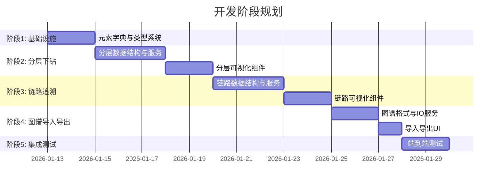
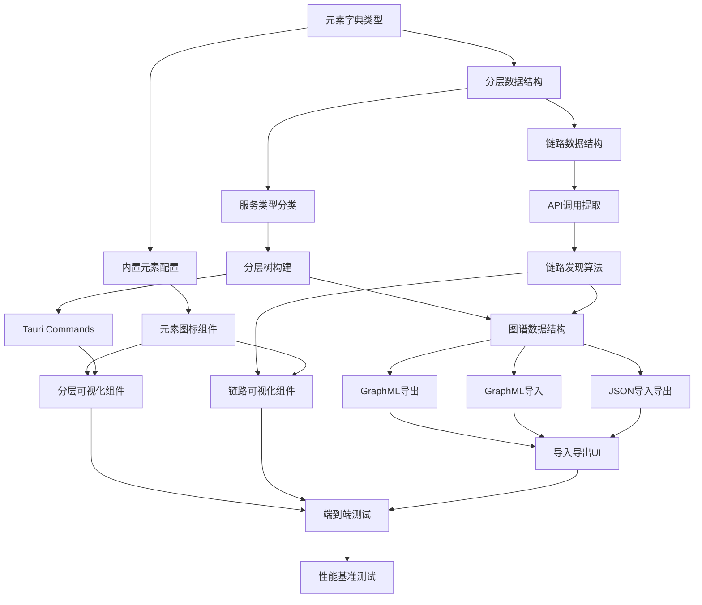

# 可视化分析系统开发任务计划 v2.5

基于设计方案 v2.5，按 Vibe Coding 理念拆分为原子化开发任务。

---

## 开发阶段总览



---

## 阶段 1: 基础设施 (2天)

### Task 1.1: 元素字典类型定义

| 项目 | 内容 |
|------|------|
| **业务目标** | 建立统一的可视化元素分类体系，支持后续扩展 |
| **技术目标** | 定义 TypeScript 和 Rust 类型，实现前后端类型一致 |

**实现内容**:
- [ ] 创建 `src/types/elementDictionary.ts`
- [ ] 创建 `src-tauri/src/models/element_dictionary.rs`
- [ ] 定义 `ElementCategory`、`NodeShape`、`ElementDefinition` 类型

**单元测试**:
```typescript
// src/types/__tests__/elementDictionary.test.ts
describe('ElementDictionary', () => {
  test('should have all required categories', () => {});
  test('should validate element definition structure', () => {});
});
```

```rust
// src-tauri/src/models/element_dictionary.rs
#[cfg(test)]
mod tests {
    #[test]
    fn test_element_serialization() {}
    #[test]
    fn test_element_deserialization() {}
}
```

---

### Task 1.2: 内置元素字典配置

| 项目 | 内容 |
|------|------|
| **业务目标** | 提供 30+ 开箱即用的元素类型，覆盖常见代码结构 |
| **技术目标** | JSON 配置文件加载，运行时可扩展 |

**实现内容**:
- [ ] 创建 `src/config/element-dictionary.json`（30+ 内置元素）
- [ ] 创建 `src/hooks/useElementDictionary.ts`
- [ ] 实现元素字典加载与合并逻辑

**单元测试**:
```typescript
describe('useElementDictionary', () => {
  test('should load builtin elements', () => {});
  test('should merge custom elements', () => {});
  test('should get element by id', () => {});
});
```

---

### Task 1.3: 元素图标组件

| 项目 | 内容 |
|------|------|
| **业务目标** | 每种元素类型有独立图标，可视化时一目了然 |
| **技术目标** | 基于 Lucide React 实现动态图标渲染 |

**实现内容**:
- [ ] 创建 `src/components/ElementIcon.tsx`
- [ ] 创建 `src/components/nodes/ShapedNode.tsx`
- [ ] 集成到 React Flow 自定义节点

**单元测试**:
```typescript
describe('ElementIcon', () => {
  test('should render correct icon for element type', () => {});
  test('should fallback to HelpCircle for unknown icon', () => {});
  test('should apply correct color from element definition', () => {});
});

describe('ShapedNode', () => {
  test('should render rectangle shape', () => {});
  test('should render rounded-rect shape', () => {});
  test('should render circle shape', () => {});
  test('should render hexagon shape', () => {});
  test('should render cylinder shape', () => {});
});
```

---

## 阶段 2: 分层下钻 (5天)

### Task 2.1: 分层数据结构定义

| 项目 | 内容 |
|------|------|
| **业务目标** | 支持六层架构表示（服务类型→目录→模块→子模块→类→方法） |
| **技术目标** | 定义树形数据结构，支持懒加载 |

**实现内容**:
- [ ] 创建 `src/types/hierarchy.ts`
- [ ] 创建 `src-tauri/src/models/hierarchy.rs`
- [ ] 定义 `HierarchyLevel`、`HierarchicalNode`、`NodeStats`

**单元测试**:
```rust
#[cfg(test)]
mod tests {
    #[test]
    fn test_hierarchy_level_ordering() {}
    #[test]
    fn test_node_stats_aggregation() {}
    #[test]
    fn test_hierarchical_node_serialization() {}
}
```

---

### Task 2.2: 服务类型分类算法

| 项目 | 内容 |
|------|------|
| **业务目标** | 自动识别前端/后端/中间件/数据库服务 |
| **技术目标** | 基于目录结构和特征文件的规则匹配 |

**实现内容**:
- [ ] 创建 `src-tauri/src/services/classifier.rs`
- [ ] 实现 `classify_service_type()` 函数
- [ ] 支持自定义分类规则

**单元测试**:
```rust
#[cfg(test)]
mod tests {
    #[test]
    fn test_classify_frontend_by_package_json() {}
    #[test]
    fn test_classify_frontend_by_vite_config() {}
    #[test]
    fn test_classify_backend_by_pom_xml() {}
    #[test]
    fn test_classify_backend_by_cargo_toml() {}
    #[test]
    fn test_classify_middleware_by_gateway_dir() {}
    #[test]
    fn test_classify_database_by_migrations_dir() {}
    #[test]
    fn test_classify_unknown_fallback() {}
}
```

---

### Task 2.3: 分层树构建服务

| 项目 | 内容 |
|------|------|
| **业务目标** | 从解析结果构建完整的分层树结构 |
| **技术目标** | 递归目录遍历，自底向上统计聚合 |

**实现内容**:
- [ ] 创建 `src-tauri/src/services/hierarchy_service.rs`
- [ ] 实现 `build_hierarchy()` 函数
- [ ] 实现 `get_children()` 懒加载函数
- [ ] 实现节点统计信息聚合

**单元测试**:
```rust
#[cfg(test)]
mod tests {
    #[test]
    fn test_build_hierarchy_single_service() {}
    #[test]
    fn test_build_hierarchy_multiple_services() {}
    #[test]
    fn test_get_children_lazy_load() {}
    #[test]
    fn test_stats_aggregation_file_count() {}
    #[test]
    fn test_stats_aggregation_line_count() {}
}
```

**集成测试**:
```rust
#[cfg(test)]
mod integration_tests {
    #[test]
    fn test_build_hierarchy_from_real_project() {
        // 使用 fixtures/sample-project 测试
    }
}
```

---

### Task 2.4: Tauri Commands 注册

| 项目 | 内容 |
|------|------|
| **业务目标** | 前端可通过 IPC 调用分层相关功能 |
| **技术目标** | 注册 `build_hierarchy`、`get_hierarchy_children` Commands |

**实现内容**:
- [ ] 创建 `src-tauri/src/commands/hierarchy.rs`
- [ ] 在 `lib.rs` 中注册 Commands
- [ ] 实现错误处理和返回结构

**集成测试**:
```rust
#[cfg(test)]
mod integration_tests {
    #[tokio::test]
    async fn test_build_hierarchy_command() {}
    #[tokio::test]
    async fn test_get_children_command() {}
}
```

---

### Task 2.5: 分层可视化组件

| 项目 | 内容 |
|------|------|
| **业务目标** | 用户可通过双击节点逐层下钻浏览代码结构 |
| **技术目标** | 基于 React Flow 实现分层布局，支持动态加载 |

**实现内容**:
- [ ] 创建 `src/components/HierarchicalGraph.tsx`
- [ ] 创建 `src/components/Breadcrumb.tsx`
- [ ] 创建 `src/hooks/useHierarchy.ts`
- [ ] 实现节点双击下钻交互
- [ ] 实现面包屑导航

**单元测试**:
```typescript
describe('HierarchicalGraph', () => {
  test('should render level 1 nodes initially', () => {});
  test('should drill down on node double click', () => {});
  test('should update breadcrumb on drill down', () => {});
  test('should navigate back via breadcrumb click', () => {});
});

describe('useHierarchy', () => {
  test('should fetch hierarchy on mount', () => {});
  test('should load children on drill down', () => {});
  test('should maintain navigation history', () => {});
});
```

---

## 阶段 3: 链路追溯 (5天)

### Task 3.1: 链路数据结构定义

| 项目 | 内容 |
|------|------|
| **业务目标** | 表示从前端到数据库的完整调用链 |
| **技术目标** | 定义节点类型、边类型、链路结构 |

**实现内容**:
- [ ] 创建 `src/types/linkTrace.ts`
- [ ] 创建 `src-tauri/src/models/link_trace.rs`
- [ ] 定义 `LinkNodeType`、`LinkNode`、`LinkEdge`、`LinkTrace`

**单元测试**:
```rust
#[cfg(test)]
mod tests {
    #[test]
    fn test_link_node_type_layer_mapping() {}
    #[test]
    fn test_link_trace_serialization() {}
}
```

---

### Task 3.2: API 调用提取

| 项目 | 内容 |
|------|------|
| **业务目标** | 从前端代码中识别 API 调用点 |
| **技术目标** | 解析 fetch/axios/invoke 调用，提取端点 |

**实现内容**:
- [ ] 创建 `src-tauri/src/services/api_extractor.rs`
- [ ] 实现 `find_api_calls()` 函数
- [ ] 支持 React/Vue 常见 HTTP 客户端

**单元测试**:
```rust
#[cfg(test)]
mod tests {
    #[test]
    fn test_extract_fetch_call() {}
    #[test]
    fn test_extract_axios_call() {}
    #[test]
    fn test_extract_tauri_invoke() {}
    #[test]
    fn test_resolve_dynamic_endpoint() {}
}
```

---

### Task 3.3: 链路发现算法

| 项目 | 内容 |
|------|------|
| **业务目标** | 从 API 调用追溯到数据库访问，形成完整链路 |
| **技术目标** | BFS 遍历依赖图，匹配调用关系 |

**实现内容**:
- [ ] 创建 `src-tauri/src/services/link_service.rs`
- [ ] 实现 `discover_trace()` 函数
- [ ] 实现 `build_return_path()` 返回链路构建

**单元测试**:
```rust
#[cfg(test)]
mod tests {
    #[test]
    fn test_discover_simple_trace() {}
    #[test]
    fn test_discover_trace_with_middleware() {}
    #[test]
    fn test_build_return_path() {}
    #[test]
    fn test_trace_completeness_check() {}
}
```

**集成测试**:
```rust
#[cfg(test)]
mod integration_tests {
    #[test]
    fn test_discover_login_flow_trace() {
        // 使用 fixtures/sample-project 测试登录链路
    }
}
```

---

### Task 3.4: 链路可视化组件

| 项目 | 内容 |
|------|------|
| **业务目标** | 用户可直观查看从前端到数据库的调用链路 |
| **技术目标** | 泳道布局展示各层节点，区分正向/返回链路 |

**实现内容**:
- [ ] 创建 `src/components/LinkTraceGraph.tsx`
- [ ] 创建 `src/components/SwimLane.tsx`
- [ ] 创建 `src/hooks/useLinkTrace.ts`
- [ ] 实现节点按层分组布局
- [ ] 实现正向边（实线）和返回边（虚线）

**单元测试**:
```typescript
describe('LinkTraceGraph', () => {
  test('should render nodes in correct swim lanes', () => {});
  test('should render forward edges as solid lines', () => {});
  test('should render return edges as dashed lines', () => {});
  test('should highlight selected trace', () => {});
});
```

---

## 阶段 4: 图谱导入导出 (3天)

### Task 4.1: 图谱数据结构

| 项目 | 内容 |
|------|------|
| **业务目标** | 分析结果可持久化存储，支持离线查看 |
| **技术目标** | 定义统一的图谱数据格式 |

**实现内容**:
- [ ] 创建 `src/types/codeGraph.ts`
- [ ] 创建 `src-tauri/src/models/code_graph.rs`
- [ ] 定义 `CodeGraph`、`GraphNode`、`GraphEdge`

**单元测试**:
```rust
#[cfg(test)]
mod tests {
    #[test]
    fn test_code_graph_serialization() {}
    #[test]
    fn test_graph_stats_calculation() {}
}
```

---

### Task 4.2: GraphML 导出

| 项目 | 内容 |
|------|------|
| **业务目标** | 导出的文件可被 yEd/Gephi 等工具打开 |
| **技术目标** | 生成符合 GraphML 规范的 XML 文件 |

**实现内容**:
- [ ] 创建 `src-tauri/src/services/graphml_exporter.rs`
- [ ] 实现 `export_graphml()` 函数
- [ ] 包含节点属性和边属性

**单元测试**:
```rust
#[cfg(test)]
mod tests {
    #[test]
    fn test_export_empty_graph() {}
    #[test]
    fn test_export_single_node() {}
    #[test]
    fn test_export_with_edges() {}
    #[test]
    fn test_export_with_custom_attributes() {}
    #[test]
    fn test_graphml_xml_validity() {}
}
```

---

### Task 4.3: GraphML 导入

| 项目 | 内容 |
|------|------|
| **业务目标** | 可加载之前导出的图谱文件直接可视化 |
| **技术目标** | 解析 GraphML XML，重建图谱对象 |

**实现内容**:
- [ ] 创建 `src-tauri/src/services/graphml_importer.rs`
- [ ] 实现 `import_graphml()` 函数
- [ ] 处理格式错误和兼容性

**单元测试**:
```rust
#[cfg(test)]
mod tests {
    #[test]
    fn test_import_valid_graphml() {}
    #[test]
    fn test_import_with_missing_attributes() {}
    #[test]
    fn test_import_invalid_xml_error() {}
    #[test]
    fn test_roundtrip_export_import() {}
}
```

---

### Task 4.4: JSON 导入导出

| 项目 | 内容 |
|------|------|
| **业务目标** | 提供更易解析的 JSON 格式选项 |
| **技术目标** | 直接序列化/反序列化 CodeGraph |

**实现内容**:
- [ ] 创建 `src-tauri/src/services/json_io.rs`
- [ ] 实现 `export_json()` 和 `import_json()` 函数

**单元测试**:
```rust
#[cfg(test)]
mod tests {
    #[test]
    fn test_export_json() {}
    #[test]
    fn test_import_json() {}
    #[test]
    fn test_json_roundtrip() {}
}
```

---

### Task 4.5: 导入导出 UI

| 项目 | 内容 |
|------|------|
| **业务目标** | 用户可通过界面按钮导入导出图谱 |
| **技术目标** | 集成文件选择对话框，显示操作进度 |

**实现内容**:
- [ ] 创建 `src/components/GraphIOPanel.tsx`
- [ ] 创建 `src/hooks/useGraphIO.ts`
- [ ] 使用 Tauri dialog 插件

**单元测试**:
```typescript
describe('GraphIOPanel', () => {
  test('should render export buttons', () => {});
  test('should render import button', () => {});
  test('should call export with correct format', () => {});
});
```

---

## 阶段 5: 集成测试与验收 (2天)

### Task 5.1: 端到端测试

| 项目 | 内容 |
|------|------|
| **业务目标** | 验证完整用户流程正常工作 |
| **技术目标** | Playwright 自动化测试 |

**测试用例**:
```typescript
describe('E2E: Hierarchical View', () => {
  test('should analyze project and show hierarchy', async () => {});
  test('should drill down to method level', async () => {});
  test('should navigate back via breadcrumb', async () => {});
});

describe('E2E: Link Trace View', () => {
  test('should discover login trace', async () => {});
  test('should show swim lane layout', async () => {});
});

describe('E2E: Import/Export', () => {
  test('should export and reimport graph', async () => {});
});
```

---

### Task 5.2: 性能基准测试

| 项目 | 内容 |
|------|------|
| **业务目标** | 确保大型项目分析不卡顿 |
| **技术目标** | 1000+ 文件项目分析 < 10s |

**测试用例**:
```rust
#[cfg(test)]
mod benchmarks {
    #[test]
    fn bench_parse_1000_files() {}
    #[test]
    fn bench_build_hierarchy_1000_nodes() {}
    #[test]
    fn bench_export_graphml_1000_nodes() {}
}
```

---

## 任务依赖关系



---

## 总结

- **总任务数**: 17 个原子化任务
- **预计工期**: 17 天
- **测试覆盖**: 每个任务包含单元测试，关键任务包含集成测试
- **验收标准**: 所有测试通过 + E2E 验收通过
