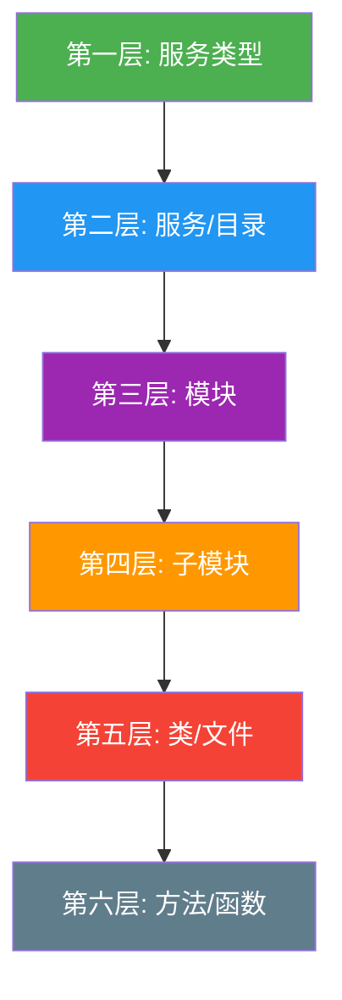
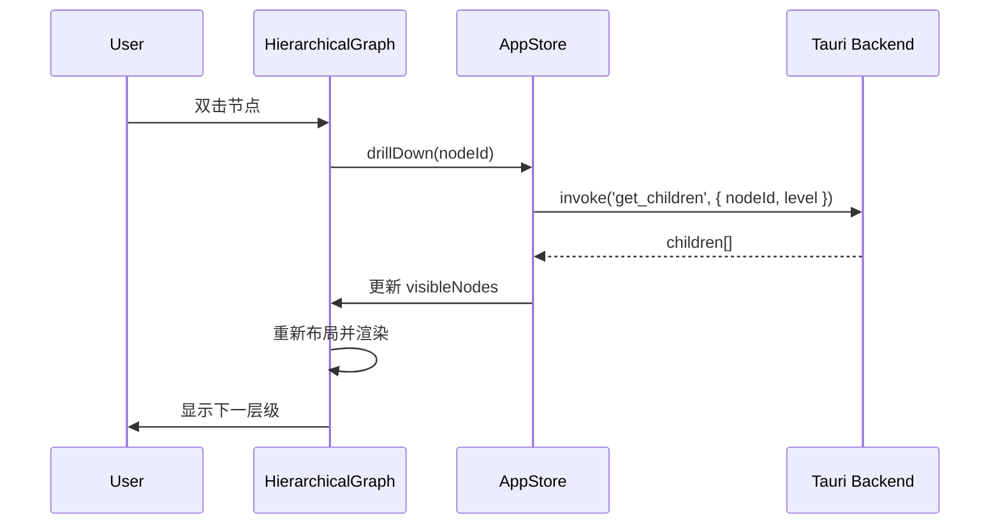

# 分层下钻可视化方案设计 v2.3

**版本**: 2.3  
**日期**: 2026-01-12  
**状态**: 待审核  
**基于**: 技术实现方案 v2.1

---

## 背景与问题

### 当前问题


如上图所示，当前可视化方案存在以下问题：

| 问题 | 描述 |
|------|------|
| **节点过于密集** | 所有文件节点平铺展示，大型项目难以阅读 |
| **层次不清晰** | 无法区分前端/后端/中间件等服务边界 |
| **缺乏上下文** | 用户无法快速定位到关注的代码区域 |
| **交互受限** | 只能通过缩放和拖拽浏览，缺乏语义化导航 |

---

## 设计目标

1. **分级展示**: 实现六层分级架构，从宏观到微观逐步展开
2. **下钻交互**: 点击节点可展开查看下一层级详情
3. **上下文保持**: 提供面包屑导航，随时可返回上层视图
4. **性能优化**: 每层只渲染当前可见节点，避免大规模渲染

---

## 分层架构设计

### 层级定义



| 层级 | 名称 | 示例 | 节点类型 |
|------|------|------|----------|
| L1 | 服务类型 | 前端服务、后端服务、中间件、数据库 | `ServiceType` |
| L2 | 服务/目录 | `ruoyi-system`、`ruoyi-gateway` | `ServiceDirectory` |
| L3 | 模块 | `controller`、`service`、`domain` | `Module` |
| L4 | 子模块 | `user`、`auth`、`permission` | `SubModule` |
| L5 | 类/文件 | `UserController.java`、`AuthService.ts` | `Class` / `File` |
| L6 | 方法/函数 | `getUserById()`, `login()` | `Method` / `Function` |

---

## 服务类型判定规则

### 自动分类规则

```typescript
interface ServiceClassificationRule {
  type: ServiceType;
  patterns: {
    directory?: RegExp[];      // 目录名匹配
    files?: RegExp[];          // 特征文件匹配
    dependencies?: string[];   // 依赖包匹配
  };
}

const classificationRules: ServiceClassificationRule[] = [
  {
    type: 'Frontend',
    patterns: {
      files: [/package\.json/, /vite\.config/, /next\.config/, /webpack\.config/],
      dependencies: ['react', 'vue', 'angular', 'svelte'],
      directory: [/src\/components/, /src\/pages/, /src\/views/],
    },
  },
  {
    type: 'Backend',
    patterns: {
      files: [/pom\.xml/, /build\.gradle/, /Cargo\.toml/, /go\.mod/],
      directory: [/src\/main\/java/, /src\/controllers/, /src\/services/],
    },
  },
  {
    type: 'Middleware',
    patterns: {
      directory: [/gateway/, /proxy/, /api-gateway/],
      dependencies: ['spring-cloud-gateway', 'zuul', 'kong'],
    },
  },
  {
    type: 'Database',
    patterns: {
      files: [/migrations/, /seeds/, /schema\.sql/],
      directory: [/db/, /database/, /migrations/],
    },
  },
];
```

---

## 数据结构设计

### 前端类型定义

```typescript
// src/types/hierarchy.ts

export enum HierarchyLevel {
  ServiceType = 1,
  ServiceDirectory = 2,
  Module = 3,
  SubModule = 4,
  Class = 5,
  Method = 6,
}

export enum ServiceType {
  Frontend = 'Frontend',
  Backend = 'Backend',
  Middleware = 'Middleware',
  Database = 'Database',
  Unknown = 'Unknown',
}

export interface HierarchicalNode {
  id: string;
  name: string;
  level: HierarchyLevel;
  type: ServiceType | string;
  path: string;
  
  // 统计信息
  stats: {
    childCount: number;       // 直接子节点数量
    totalDescendants: number; // 所有后代节点数量
    fileCount: number;        // 包含的文件数
    lineCount: number;        // 代码行数
    issueCount: number;       // 问题数量
  };
  
  // 子节点（懒加载）
  children?: HierarchicalNode[];
  isExpanded: boolean;
  isLoading: boolean;
  
  // 关联信息
  dependencies: string[];     // 依赖的其他节点 ID
  dependents: string[];       // 被依赖的节点 ID
}

export interface HierarchicalGraph {
  root: HierarchicalNode;
  currentLevel: HierarchyLevel;
  currentPath: string[];      // 面包屑路径
  visibleNodes: HierarchicalNode[];
  edges: HierarchicalEdge[];
}

export interface HierarchicalEdge {
  source: string;
  target: string;
  weight: number;             // 依赖强度
  type: 'import' | 'extends' | 'implements' | 'uses';
}
```

### Rust 后端数据结构

```rust
// src-tauri/src/models/hierarchy.rs

use serde::{Deserialize, Serialize};

#[derive(Debug, Clone, Serialize, Deserialize)]
pub enum HierarchyLevel {
    ServiceType = 1,
    ServiceDirectory = 2,
    Module = 3,
    SubModule = 4,
    Class = 5,
    Method = 6,
}

#[derive(Debug, Clone, Serialize, Deserialize)]
pub enum ServiceType {
    Frontend,
    Backend,
    Middleware,
    Database,
    Unknown,
}

#[derive(Debug, Clone, Serialize, Deserialize)]
pub struct HierarchicalNode {
    pub id: String,
    pub name: String,
    pub level: HierarchyLevel,
    pub service_type: ServiceType,
    pub path: String,
    pub stats: NodeStats,
    pub children: Option<Vec<HierarchicalNode>>,
    pub dependencies: Vec<String>,
    pub dependents: Vec<String>,
}

#[derive(Debug, Clone, Serialize, Deserialize)]
pub struct NodeStats {
    pub child_count: usize,
    pub total_descendants: usize,
    pub file_count: usize,
    pub line_count: usize,
    pub issue_count: usize,
}

#[derive(Debug, Clone, Serialize, Deserialize)]
pub struct HierarchicalGraph {
    pub root: HierarchicalNode,
    pub current_level: HierarchyLevel,
    pub current_path: Vec<String>,
}
```

---

## Proposed Changes

### Rust 后端

#### [NEW] [hierarchy.rs](file:///E:/work/trae/claudecode/bun-codeview/src-tauri/src/models/hierarchy.rs)
新增分层数据结构定义。

#### [MODIFY] [lib.rs](file:///E:/work/trae/claudecode/bun-codeview/src-tauri/src/lib.rs)
注册新的 Tauri Commands。

#### [NEW] [hierarchy_service.rs](file:///E:/work/trae/claudecode/bun-codeview/src-tauri/src/services/hierarchy_service.rs)
新增分层聚合服务：
- `build_hierarchy()`: 从解析结果构建分层树
- `get_children()`: 懒加载获取子节点
- `classify_service()`: 服务类型自动分类

---

### React 前端

#### [NEW] [hierarchy.ts](file:///E:/work/trae/claudecode/bun-codeview/src/types/hierarchy.ts)
新增分层数据类型定义。

#### [NEW] [HierarchicalGraph.tsx](file:///E:/work/trae/claudecode/bun-codeview/src/components/HierarchicalGraph.tsx)
新增分层可视化组件：
- 支持六层级下钻
- 面包屑导航
- 节点聚合展示
- 依赖关系可视化

#### [NEW] [useHierarchy.ts](file:///E:/work/trae/claudecode/bun-codeview/src/hooks/useHierarchy.ts)
新增分层数据管理 Hook。

#### [MODIFY] [useAppStore.ts](file:///E:/work/trae/claudecode/bun-codeview/src/store/useAppStore.ts)
增加分层相关状态管理。

#### [MODIFY] [App.tsx](file:///E:/work/trae/claudecode/bun-codeview/src/App.tsx)
集成新的分层可视化组件，提供视图切换。

---

## 交互设计

### 下钻操作



### 面包屑导航

```
服务类型 / 后端服务 / ruoyi-system / service / user / UserService.java
    ↑         ↑           ↑           ↑      ↑          ↑
   L1        L2          L3         L4     L5         L6
```

点击任意层级可直接跳转到该层视图。

### 节点样式

| 层级 | 形状 | 颜色 | 大小 |
|------|------|------|------|
| L1 服务类型 | 圆角矩形 | 绿色系 `#4CAF50` | 大 (200x100) |
| L2 服务目录 | 圆角矩形 | 蓝色系 `#2196F3` | 中大 (180x90) |
| L3 模块 | 圆角矩形 | 紫色系 `#9C27B0` | 中 (160x80) |
| L4 子模块 | 圆角矩形 | 橙色系 `#FF9800` | 中 (150x70) |
| L5 类/文件 | 圆角矩形 | 红色系 `#f44336` | 小 (140x60) |
| L6 方法 | 圆形 | 灰色系 `#607D8B` | 最小 (100x50) |

---

## API 设计

### 新增 Tauri Commands

```rust
#[tauri::command]
pub async fn build_hierarchy(
    path: String,
    state: tauri::State<'_, AppState>,
) -> Result<HierarchicalGraph, String>;

#[tauri::command]
pub async fn get_hierarchy_children(
    node_id: String,
    target_level: HierarchyLevel,
    state: tauri::State<'_, AppState>,
) -> Result<Vec<HierarchicalNode>, String>;

#[tauri::command]
pub async fn get_node_dependencies(
    node_id: String,
    state: tauri::State<'_, AppState>,
) -> Result<Vec<HierarchicalEdge>, String>;
```

### 前端 API 封装

```typescript
// src/services/hierarchyApi.ts

export const HierarchyAPI = {
  buildHierarchy: (path: string): Promise<HierarchicalGraph> =>
    invoke('build_hierarchy', { path }),

  getChildren: (nodeId: string, level: HierarchyLevel): Promise<HierarchicalNode[]> =>
    invoke('get_hierarchy_children', { nodeId, targetLevel: level }),

  getDependencies: (nodeId: string): Promise<HierarchicalEdge[]> =>
    invoke('get_node_dependencies', { nodeId }),
};
```

---

## Verification Plan

### 自动化测试

#### 1. Rust 单元测试

运行命令：
```bash
cd src-tauri && cargo test
```

测试用例：
- `test_classify_service_frontend`: 验证前端服务识别
- `test_classify_service_backend`: 验证后端服务识别
- `test_build_hierarchy_from_parse_results`: 验证层次结构构建
- `test_aggregate_stats`: 验证统计信息聚合

#### 2. 前端单元测试

运行命令：
```bash
bun test
```

测试用例：
- `HierarchicalGraph.test.tsx`: 组件渲染测试
- `useHierarchy.test.ts`: Hook 逻辑测试

### 手动验证

> [!IMPORTANT]
> 以下手动测试需要用户配合执行。

#### 测试步骤

1. **启动应用**
   ```bash
   cd E:\work\trae\claudecode\bun-codeview
   bun tauri dev
   ```

2. **加载测试项目**
   - 在应用中选择一个包含多个服务的项目（如 RuoYi-Cloud）
   - 点击"深度分析"按钮

3. **验证第一层展示**
   - 确认显示服务类型节点（前端服务、后端服务、中间件、数据库）
   - 每个节点应显示子节点数量统计

4. **验证下钻功能**
   - 双击"后端服务"节点
   - 确认显示下一层级（如 ruoyi-system、ruoyi-gateway 等）
   - 面包屑应更新为：`服务类型 / 后端服务`

5. **验证面包屑导航**
   - 继续下钻到第四层
   - 点击面包屑中的"后端服务"
   - 确认视图正确返回到第二层

6. **验证依赖关系**
   - 在任意层级选中一个节点
   - 确认相关依赖边正确高亮显示

---

## 风险评估

| 风险 | 概率 | 影响 | 缓解措施 |
|------|------|------|----------|
| 大型项目层次构建性能 | 中 | 高 | 实现懒加载，只在下钻时加载子节点 |
| 服务类型误判 | 中 | 中 | 提供手动调整功能，允许用户修正分类 |
| 复杂依赖关系可视化混乱 | 中 | 中 | 在高层级只显示聚合依赖，细节在下钻后展示 |

---

## 总结

本方案通过六层分级架构和下钻交互，解决了当前可视化过于密集的问题，使用户能够从宏观的服务架构逐步深入到微观的方法级别，同时保持清晰的上下文导航。
