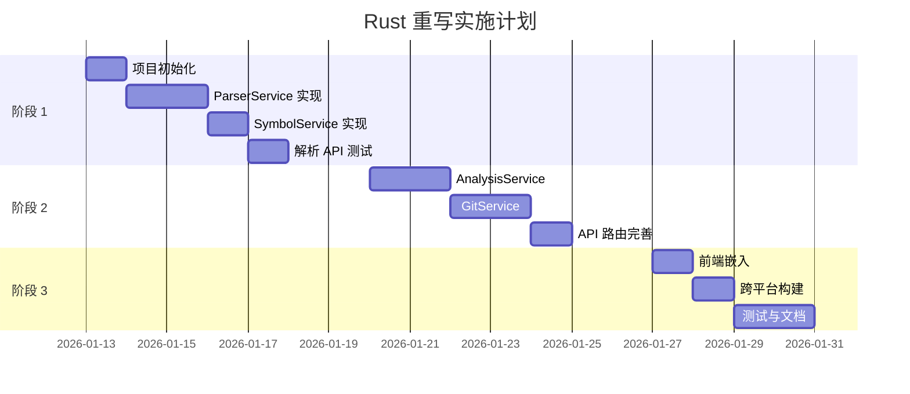

# CodeView Rust 重写设计方案

**版本**: 1.0  
**日期**: 2026-01-11  
**状态**: 草案

---

## 目录

1. [背景与动机](#背景与动机)
2. [架构方案对比](#架构方案对比)
3. [推荐方案详解](#推荐方案详解)
4. [技术栈选型](#技术栈选型)
5. [迁移策略](#迁移策略)
6. [实施计划](#实施计划)
7. [风险评估](#风险评估)

---

## 背景与动机

### 当前技术栈问题

| 问题 | 影响 | 根因 |
|------|------|------|
| tree-sitter 编译不可用 | 代码解析功能降级 | Emscripten WASM 与 Bun $bunfs 不兼容 |
| 二进制体积大 | 66MB 的可执行文件 | 包含完整 Bun 运行时 |
| 外部资源依赖 | 需要 public/ 目录 | 前端资源未完全嵌入 |

### 目标

- ✅ 完整的代码解析功能（tree-sitter 原生）
- ✅ 真正的单文件可执行程序
- ✅ 更小的二进制体积 (< 20MB)
- ✅ 更好的跨平台支持
- ✅ 更高的解析性能

---

## 架构方案对比

### 方案 A: 完全 Rust 重写 (Tauri)

```
┌─────────────────────────────────────────┐
│              Tauri 应用                  │
├─────────────────────────────────────────┤
│  ┌─────────────────────────────────┐    │
│  │     前端 (React/Vue/Svelte)      │    │
│  │     使用系统 WebView 渲染         │    │
│  └─────────────────────────────────┘    │
│                  │ IPC                   │
│  ┌─────────────────────────────────┐    │
│  │         Rust 后端核心            │    │
│  │  ┌───────────────────────────┐  │    │
│  │  │ tree-sitter (原生)        │  │    │
│  │  │ 文件分析服务               │  │    │
│  │  │ Git 集成                   │  │    │
│  │  │ 依赖图分析                 │  │    │
│  │  └───────────────────────────┘  │    │
│  └─────────────────────────────────┘    │
└─────────────────────────────────────────┘
```

**优势**:
- 真正单文件可执行 (< 10MB)
- 原生性能，解析速度提升 45%+
- 内存占用低
- 跨平台支持 (Windows/macOS/Linux/iOS/Android)

**劣势**:
- 完全重写后端
- 学习曲线较高
- 开发周期长 (3-4 周)

---

### 方案 B: 完全 Rust 重写 (Axum Web Server)

```
┌─────────────────────────────────────────┐
│           Axum Web Server               │
├─────────────────────────────────────────┤
│  ┌─────────────────────────────────┐    │
│  │     静态文件服务                  │    │
│  │     (嵌入的前端资源)              │    │
│  └─────────────────────────────────┘    │
│                  │                       │
│  ┌─────────────────────────────────┐    │
│  │         API 路由层               │    │
│  │  POST /api/analyze              │    │
│  │  GET  /api/git/history          │    │
│  │  GET  /api/health               │    │
│  └─────────────────────────────────┘    │
│                  │                       │
│  ┌─────────────────────────────────┐    │
│  │         业务服务层               │    │
│  │  ┌───────────────────────────┐  │    │
│  │  │ ParserService (tree-sitter)│  │    │
│  │  │ AnalysisService            │  │    │
│  │  │ GitService                 │  │    │
│  │  └───────────────────────────┘  │    │
│  └─────────────────────────────────┘    │
└─────────────────────────────────────────┘
```

**优势**:
- 与当前架构类似，迁移相对容易
- 保持 Web 应用模式
- 可直接复用现有前端
- 开发周期适中 (2-3 周)

**劣势**:
- 不是真正的桌面应用
- 需要用户打开浏览器

---

### 方案 C: 混合架构 (Rust CLI + Bun Server)

```
┌────────────────────────────────────────────────────────┐
│                    Bun Server (现有)                    │
├────────────────────────────────────────────────────────┤
│  ┌──────────────────────────────────────────────────┐  │
│  │              前端 (React)                         │  │
│  └──────────────────────────────────────────────────┘  │
│                         │                              │
│  ┌──────────────────────────────────────────────────┐  │
│  │              API 路由层 (Elysia)                  │  │
│  └──────────────────────────────────────────────────┘  │
│           │                        │                   │
│  ┌────────────────┐    ┌───────────────────────────┐  │
│  │ 其他服务 (JS)   │    │ 解析服务代理              │  │
│  │ - Git          │    │ (调用 Rust CLI)           │  │
│  │ - 分析         │    └───────────────────────────┘  │
│  └────────────────┘                │                   │
│                                    │ 子进程调用          │
│                    ┌───────────────────────────────┐   │
│                    │     codeview-parser (Rust)    │   │
│                    │     独立 CLI 工具             │   │
│                    │     - 符号提取                │   │
│                    │     - 语法分析                │   │
│                    └───────────────────────────────┘   │
└────────────────────────────────────────────────────────┘
```

**优势**:
- 最小改动现有代码
- 渐进式迁移
- 快速实现 (1 周)

**劣势**:
- 需要分发两个文件
- 进程间通信开销
- 不如完全 Rust 方案性能好

---

## 推荐方案详解

### 综合评估

| 维度 | 方案 A (Tauri) | 方案 B (Axum) | 方案 C (混合) |
|------|----------------|---------------|---------------|
| 开发周期 | 3-4 周 | 2-3 周 | 1 周 |
| 性能 | ⭐⭐⭐⭐⭐ | ⭐⭐⭐⭐⭐ | ⭐⭐⭐⭐ |
| 单文件分发 | ⭐⭐⭐⭐⭐ | ⭐⭐⭐⭐⭐ | ⭐⭐⭐ |
| 代码复用 | ⭐⭐ | ⭐⭐⭐ | ⭐⭐⭐⭐⭐ |
| 维护成本 | ⭐⭐⭐ | ⭐⭐⭐⭐ | ⭐⭐⭐ |
| 学习成本 | ⭐⭐ | ⭐⭐⭐ | ⭐⭐⭐⭐⭐ |

### 推荐: 方案 B (Axum) + 渐进迁移

**理由**:
1. 与当前 Elysia 架构最相似
2. 可完全复用现有 React 前端
3. 性能优秀，真正单文件
4. Rust 生态成熟，文档丰富
5. 适中的开发周期

---

## 技术栈选型

### 核心依赖

```toml
[dependencies]
# Web 框架
axum = "0.8"
tokio = { version = "1", features = ["full"] }
tower = "0.5"
tower-http = { version = "0.6", features = ["fs", "cors"] }

# 序列化
serde = { version = "1", features = ["derive"] }
serde_json = "1"

# 代码解析
tree-sitter = "0.24"
tree-sitter-typescript = "0.23"
tree-sitter-java = "0.23"

# Git 集成
git2 = "0.19"

# 静态文件嵌入
rust-embed = "8"

# 错误处理
anyhow = "1"
thiserror = "2"

# 日志
tracing = "0.1"
tracing-subscriber = "0.3"
```

### 前端资源嵌入

使用 `rust-embed` 将前端构建产物嵌入二进制：

```rust
#[derive(RustEmbed)]
#[folder = "../frontend/dist/"]
struct Assets;
```

---

## 迁移策略

### 阶段 1: 核心解析服务 (第 1 周)

```
backend-rust/
├── Cargo.toml
└── src/
    ├── main.rs           # 入口点
    ├── parser/
    │   ├── mod.rs
    │   ├── service.rs    # ParserService
    │   └── symbol.rs     # SymbolService
    └── api/
        ├── mod.rs
        └── parser.rs     # 解析 API
```

**目标**: 实现 tree-sitter 原生解析，验证性能

### 阶段 2: 完整 API 迁移 (第 2 周)

```
backend-rust/
└── src/
    ├── api/
    │   ├── analyze.rs    # 分析 API
    │   ├── git.rs        # Git API
    │   └── health.rs     # 健康检查
    ├── services/
    │   ├── analysis.rs   # AnalysisService
    │   └── git.rs        # GitService
    └── static_files.rs   # 静态文件服务
```

**目标**: 完成所有 API 端点迁移

### 阶段 3: 集成与测试 (第 3 周)

- 前端资源嵌入
- 端到端测试
- 跨平台构建 (CI/CD)
- 性能对比测试
- 文档更新

---

## 实施计划

### 时间线



### 里程碑

| 日期 | 里程碑 | 交付物 |
|------|--------|--------|
| 01-17 | M1: 解析功能 | Rust 解析服务可运行 |
| 01-24 | M2: 完整 API | 所有 API 端点迁移完成 |
| 01-31 | M3: 发布就绪 | 跨平台二进制发布 |

---

## 风险评估

| 风险 | 概率 | 影响 | 缓解措施 |
|------|------|------|----------|
| Rust 学习曲线 | 中 | 中 | 参考现有优秀项目，使用 AI 辅助 |
| tree-sitter 语言绑定问题 | 低 | 高 | 提前验证所需语言支持 |
| 跨平台构建复杂 | 中 | 中 | 使用 cross 工具链 |
| 前端集成问题 | 低 | 低 | 复用现有前端，仅修改 API 地址 |

---

## 附录

### 参考资源

- [Axum 官方文档](https://docs.rs/axum/)
- [tree-sitter Rust 绑定](https://docs.rs/tree-sitter/)
- [rust-embed 静态资源嵌入](https://docs.rs/rust-embed/)
- [Tauri 官方文档](https://tauri.app/)

### 相关文件

- 当前后端: `backend/src/`
- 当前前端: `frontend/src/`
- 构建脚本: `scripts/`
