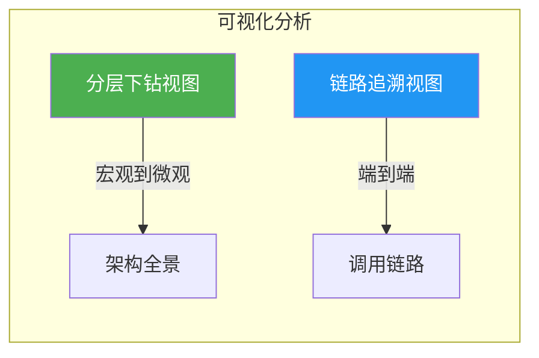
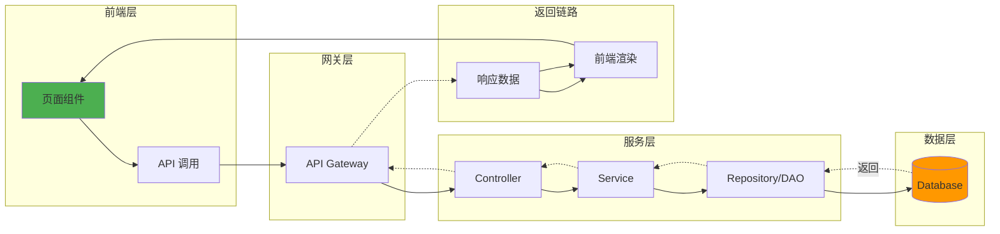

# 可视化分析方案设计 v2.4

**版本**: 2.4  
**日期**: 2026-01-12  
**状态**: 待审核  
**基于**: v2.3 分层可视化方案

---

## 可视化模式概览

本方案提供两类互补的可视化分析模式：



| 模式 | 用途 | 适用场景 |
|------|------|----------|
| **分层下钻** | 从服务类型逐级深入到方法级别 | 架构理解、模块定位、代码浏览 |
| **链路追溯** | 从前端功能追溯完整调用链 | 问题排查、影响分析、链路梳理 |

---

## 一、分层下钻视图 (v2.3 延续)

详见 [hierarchical-visualization-v2.3.md](file:///E:/work/trae/claudecode/bun-codeview/design/hierarchical-visualization-v2.3.md)

六层分级架构：服务类型 → 目录 → 模块 → 子模块 → 类 → 方法

---

## 二、链路追溯视图 (新增)

### 设计目标

实现从前端页面模块到数据库的完整调用链可视化，形成闭环展示。

### 链路模型



### 链路节点类型

```typescript
export enum LinkNodeType {
  // 前端层
  PageComponent = 'PageComponent',     // 页面组件
  UIAction = 'UIAction',               // 用户操作（按钮点击等）
  APICall = 'APICall',                 // API 调用
  
  // 网关层
  Gateway = 'Gateway',                 // API 网关
  RouteRule = 'RouteRule',             // 路由规则
  
  // 服务层
  Controller = 'Controller',           // 控制器
  ServiceMethod = 'ServiceMethod',     // 服务方法
  Repository = 'Repository',           // 数据访问层
  
  // 中间件层
  MessageQueue = 'MessageQueue',       // 消息队列
  Cache = 'Cache',                     // 缓存
  
  // 数据层
  DatabaseTable = 'DatabaseTable',     // 数据库表
  SQLQuery = 'SQLQuery',               // SQL 查询
  
  // 返回层
  ResponseDTO = 'ResponseDTO',         // 响应数据
  DataTransform = 'DataTransform',     // 数据转换
}
```

### 链路数据结构

```typescript
export interface LinkNode {
  id: string;
  type: LinkNodeType;
  name: string;
  path: string;                        // 源码路径
  layer: 'frontend' | 'gateway' | 'service' | 'middleware' | 'database' | 'response';
  
  // 代码位置
  location?: {
    file: string;
    line: number;
    column: number;
  };
  
  // 元数据
  metadata: {
    httpMethod?: string;               // GET/POST/PUT/DELETE
    endpoint?: string;                 // /api/users
    tableName?: string;                // 数据库表名
    queueName?: string;                // 消息队列名
  };
}

export interface LinkEdge {
  source: string;
  target: string;
  type: 'call' | 'return' | 'async' | 'query';
  label?: string;                      // 调用方法名/SQL 语句
}

export interface LinkTrace {
  id: string;
  name: string;                        // 链路名称（如：用户登录流程）
  startNode: string;                   // 起始节点 ID
  nodes: LinkNode[];
  edges: LinkEdge[];
  isComplete: boolean;                 // 是否形成闭环
}
```

### 链路发现算法

```rust
// 伪代码：从前端组件发现完整调用链
pub fn discover_link_trace(
    start_component: &str,
    parse_results: &[FileAnalysisResult],
    graph: &DependencyGraph,
) -> LinkTrace {
    let mut trace = LinkTrace::new(start_component);
    let mut visited = HashSet::new();
    let mut queue = VecDeque::new();
    
    // 1. 找到前端组件中的 API 调用
    let api_calls = find_api_calls(start_component, parse_results);
    for call in api_calls {
        queue.push_back(call);
    }
    
    // 2. BFS 遍历调用链
    while let Some(node) = queue.pop_front() {
        if visited.contains(&node.id) { continue; }
        visited.insert(node.id.clone());
        trace.add_node(node.clone());
        
        // 寻找下游调用
        let callees = find_callees(&node, graph);
        for callee in callees {
            trace.add_edge(node.id.clone(), callee.id.clone());
            queue.push_back(callee);
        }
    }
    
    // 3. 构建返回链路（反向遍历）
    trace.build_return_path();
    
    trace
}
```

### 交互设计

#### 1. 链路入口选择

用户可通过以下方式发起链路追溯：
- 在分层视图中右键点击前端组件 → "追溯调用链路"
- 在搜索框中输入 API 端点 → 自动构建链路
- 从预定义的功能模块列表中选择

#### 2. 链路可视化布局

采用**水平泳道布局**，每个层级占据一个泳道：

```
┌─────────────┬─────────────┬─────────────┬─────────────┬─────────────┐
│   前端层    │   网关层    │   服务层    │  中间件层   │   数据层    │
├─────────────┼─────────────┼─────────────┼─────────────┼─────────────┤
│             │             │             │             │             │
│  ┌─────┐    │   ┌─────┐   │  ┌─────┐    │             │  ┌─────┐    │
│  │Login│───────▶│Route│──────▶│Auth │────────────────────▶│Users│   │
│  │Page │    │   │     │   │  │Ctrl │    │             │  │Table│    │
│  └─────┘    │   └─────┘   │  └──┬──┘    │             │  └─────┘    │
│      ▲      │             │     │       │             │      │      │
│      │      │             │     ▼       │             │      │      │
│      │      │             │  ┌─────┐    │             │      │      │
│      └───────────────────────│Auth │◀────────────────────────┘      │
│             │             │  │Svc  │    │             │             │
│             │             │  └─────┘    │             │             │
└─────────────┴─────────────┴─────────────┴─────────────┴─────────────┘
```

#### 3. 链路节点样式

| 层级 | 节点形状 | 颜色 |
|------|----------|------|
| 前端层 | 圆角矩形 | 绿色 `#4CAF50` |
| 网关层 | 六边形 | 蓝色 `#2196F3` |
| 服务层 | 矩形 | 紫色 `#9C27B0` |
| 中间件层 | 菱形 | 橙色 `#FF9800` |
| 数据层 | 圆柱形 | 红色 `#f44336` |
| 返回链路 | 虚线箭头 | 灰色 `#607D8B` |

---

## Proposed Changes (扩展)

### 新增后端

#### [NEW] [link_trace.rs](file:///E:/work/trae/claudecode/bun-codeview/src-tauri/src/models/link_trace.rs)
链路追溯数据结构定义。

#### [NEW] [link_service.rs](file:///E:/work/trae/claudecode/bun-codeview/src-tauri/src/services/link_service.rs)
链路发现与构建服务：
- `discover_trace()`: 从指定节点发现完整调用链
- `find_api_calls()`: 提取前端 API 调用
- `resolve_endpoint()`: 解析 API 端点对应的后端方法

### 新增前端

#### [NEW] [LinkTraceGraph.tsx](file:///E:/work/trae/claudecode/bun-codeview/src/components/LinkTraceGraph.tsx)
链路追溯可视化组件，采用泳道布局。

#### [NEW] [useLinkTrace.ts](file:///E:/work/trae/claudecode/bun-codeview/src/hooks/useLinkTrace.ts)
链路追溯状态管理 Hook。

---

## Verification Plan

### 链路追溯功能测试

1. **选择前端登录组件** → 验证能否发现完整登录链路
2. **验证泳道布局** → 确认各层节点正确分布
3. **验证返回链路** → 确认虚线正确连接响应路径
4. **验证节点点击** → 点击节点可跳转到源码位置

---

## 总结

v2.4 方案在 v2.3 的分层下钻基础上，新增了**链路追溯视图**，两种模式互补：

- **分层下钻**：适合架构理解和代码浏览（自上而下）
- **链路追溯**：适合问题排查和影响分析（端到端）

用户可在两种视图间自由切换，实现全方位的代码可视化分析。
