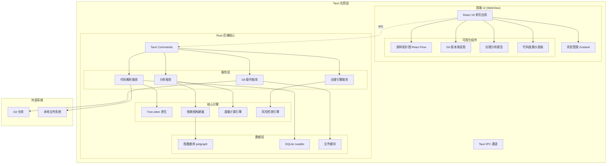
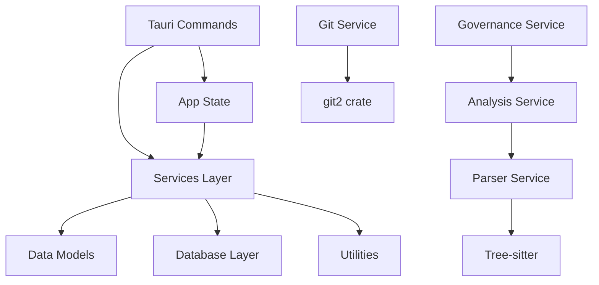
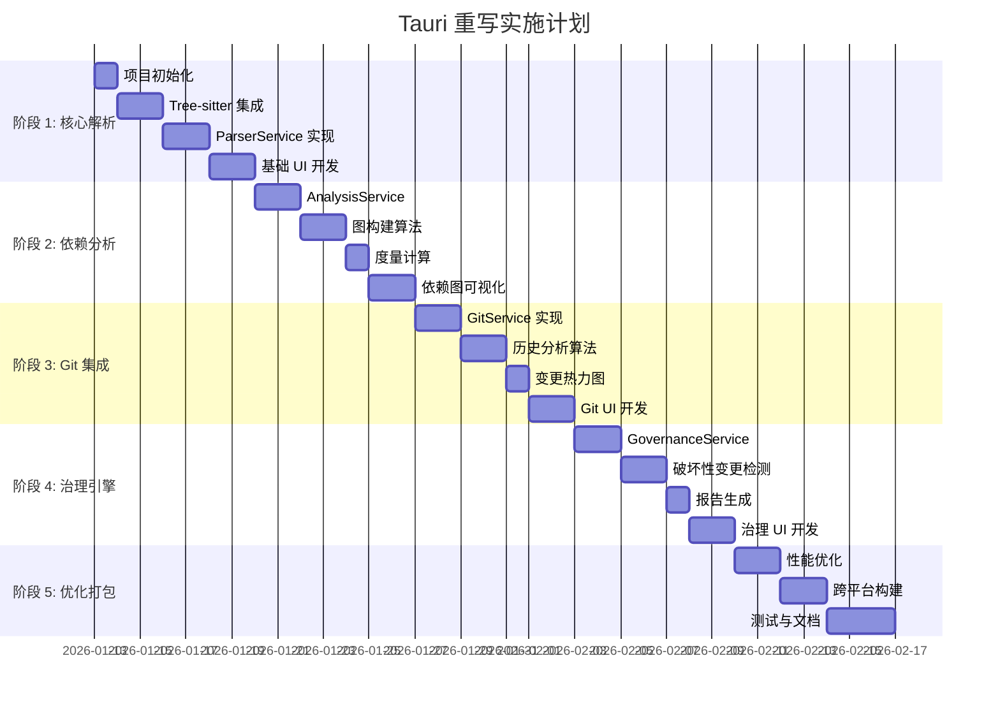

# 源码分析与 AI 开发管控系统 - 技术实现方案 v2.0

**版本**: 2.0  
**日期**: 2026-01-11  
**状态**: 草案  
**基于**: 方案 A - 完全 Rust 重写 (Tauri)

---

## 目录

1. [背景与演进](#背景与演进)
2. [总体架构设计](#总体架构设计)
3. [技术栈选型](#技术栈选型)
4. [核心模块设计](#核心模块设计)
5. [接口设计](#接口设计)
6. [项目结构规划](#项目结构规划)
7. [开发阶段规划](#开发阶段规划)
8. [性能指标与优化](#性能指标与优化)
9. [风险评估](#风险评估)
10. [附录](#附录)

---

## 背景与演进

### v1.2 方案回顾

v1.2 版本采用 **Bun + ElysiaJS + React** 技术栈：

| 组件 | 技术选型 | 问题 |
|------|---------|------|
| Runtime | Bun | tree-sitter WASM 与 Bun $bunfs 不兼容 |
| 后端框架 | ElysiaJS | 无法使用原生 tree-sitter |
| 代码解析 | Tree-sitter WASM | 性能受限，功能降级 |
| 打包产物 | 66MB 单文件 | 包含完整 Bun 运行时 |
| 资源管理 | 外部 public/ 目录 | 非真正单文件分发 |

### v2.0 升级目标

基于 **Tauri + Rust** 架构实现：

- ✅ **原生性能**: tree-sitter 原生绑定，解析速度提升 45%+
- ✅ **真正单文件**: 二进制体积 < 10MB，无外部依赖
- ✅ **跨平台支持**: Windows/macOS/Linux/iOS/Android
- ✅ **桌面应用体验**: 原生窗口、系统托盘、快捷键
- ✅ **内存优化**: Rust 零成本抽象，内存占用降低 60%

---

## 总体架构设计

### 架构图



### 核心设计原则

1. **前后端分离**: 前端 React 通过 Tauri IPC 调用 Rust 后端
2. **异步优先**: 使用 Tokio 异步运行时，避免阻塞 UI
3. **类型安全**: Rust 强类型系统 + TypeScript 端到端类型推导
4. **模块化**: 清晰的服务边界，便于测试和维护
5. **性能优先**: 原生代码解析，零拷贝数据传输

---

## 技术栈选型

### 3.1 Rust 后端技术栈

#### 核心框架

```toml
[dependencies]
# Tauri 框架
tauri = { version = "2.1", features = ["protocol-asset"] }
tauri-plugin-shell = "2.0"
tauri-plugin-fs = "2.0"
tauri-plugin-dialog = "2.0"

# 异步运行时
tokio = { version = "1.42", features = ["full"] }
async-trait = "0.1"

# 序列化
serde = { version = "1.0", features = ["derive"] }
serde_json = "1.0"

# 代码解析 (原生 tree-sitter)
tree-sitter = "0.24"
tree-sitter-typescript = "0.23"
tree-sitter-java = "0.23"
tree-sitter-python = "0.23"
tree-sitter-rust = "0.23"
tree-sitter-go = "0.23"

# Git 集成
git2 = "0.19"
gix = "0.68"  # 纯 Rust Git 实现，备选方案

# 图数据结构
petgraph = "0.6"

# 数据库
rusqlite = { version = "0.32", features = ["bundled"] }

# 错误处理
anyhow = "1.0"
thiserror = "2.0"

# 日志
tracing = "0.1"
tracing-subscriber = { version = "0.3", features = ["env-filter"] }
tracing-appender = "0.2"

# 性能分析
rayon = "1.10"  # 并行计算
dashmap = "6.1"  # 并发 HashMap
```

#### 语言支持矩阵

| 语言 | Tree-sitter Crate | 优先级 |
|------|------------------|--------|
| TypeScript/JavaScript | tree-sitter-typescript | P0 |
| Java | tree-sitter-java | P0 |
| Python | tree-sitter-python | P1 |
| Rust | tree-sitter-rust | P1 |
| Go | tree-sitter-go | P1 |
| C/C++ | tree-sitter-c, tree-sitter-cpp | P2 |

### 3.2 前端技术栈

```json
{
  "dependencies": {
    "react": "^18.3.1",
    "react-dom": "^18.3.1",
    
    "@tauri-apps/api": "^2.1.0",
    "@tauri-apps/plugin-shell": "^2.0.0",
    "@tauri-apps/plugin-fs": "^2.0.0",
    "@tauri-apps/plugin-dialog": "^2.0.0",
    
    "zustand": "^5.0.2",
    "immer": "^10.1.1",
    
    "react-flow-renderer": "^10.3.17",
    "d3": "^7.9.0",
    "vis-network": "^9.1.9",
    
    "tailwindcss": "^3.4.17",
    "@shadcn/ui": "latest",
    "lucide-react": "^0.468.0",
    
    "monaco-editor": "^0.52.2",
    "react-markdown": "^9.0.1"
  },
  "devDependencies": {
    "@vitejs/plugin-react": "^4.3.4",
    "vite": "^6.0.5",
    "typescript": "^5.7.2",
    "@tauri-apps/cli": "^2.1.0"
  }
}
```

### 3.3 开发工具链

| 工具 | 用途 | 版本 |
|------|------|------|
| Rust | 后端开发 | 1.83+ |
| Node.js | 前端构建 | 20+ |
| pnpm | 包管理 | 9+ |
| Tauri CLI | 应用打包 | 2.1+ |
| cargo-watch | 热重载 | 8.5+ |

---

## 核心模块设计

### 4.1 代码解析服务 (ParserService)

#### 职责
- 使用 tree-sitter 原生解析源代码
- 提取符号信息（类、函数、变量）
- 构建抽象语法树 (AST)
- 缓存解析结果

#### 核心接口

```rust
#[derive(Debug, Serialize, Deserialize)]
pub struct ParseResult {
    pub file_path: String,
    pub language: Language,
    pub symbols: Vec<Symbol>,
    pub imports: Vec<Import>,
    pub exports: Vec<Export>,
    pub ast_root: AstNode,
}

#[derive(Debug, Serialize, Deserialize)]
pub struct Symbol {
    pub name: String,
    pub kind: SymbolKind,  // Class, Function, Variable, etc.
    pub range: Range,
    pub modifiers: Vec<String>,
    pub signature: Option<String>,
}

#[async_trait]
pub trait ParserService: Send + Sync {
    async fn parse_file(&self, path: &Path) -> Result<ParseResult>;
    async fn parse_directory(&self, path: &Path) -> Result<Vec<ParseResult>>;
    async fn get_cached(&self, path: &Path) -> Option<ParseResult>;
}
```

#### 实现策略

```rust
pub struct TreeSitterParser {
    parsers: DashMap<Language, Parser>,
    cache: Arc<RwLock<LruCache<PathBuf, ParseResult>>>,
}

impl TreeSitterParser {
    pub fn new() -> Self {
        let mut parsers = DashMap::new();
        
        // 预加载语言解析器
        parsers.insert(Language::TypeScript, {
            let mut parser = Parser::new();
            parser.set_language(&tree_sitter_typescript::LANGUAGE_TYPESCRIPT.into()).unwrap();
            parser
        });
        
        // ... 其他语言
        
        Self {
            parsers,
            cache: Arc::new(RwLock::new(LruCache::new(1000))),
        }
    }
}
```

### 4.2 依赖分析服务 (AnalysisService)

#### 职责
- 构建模块依赖图
- 计算代码度量指标
- 检测循环依赖
- 生成依赖报告

#### 核心接口

```rust
#[derive(Debug, Serialize, Deserialize)]
pub struct DependencyGraph {
    pub nodes: Vec<ModuleNode>,
    pub edges: Vec<DependencyEdge>,
    pub metrics: GraphMetrics,
}

#[derive(Debug, Serialize, Deserialize)]
pub struct ModuleNode {
    pub id: String,
    pub path: String,
    pub kind: ModuleKind,  // File, Package, Namespace
    pub metrics: ModuleMetrics,
}

#[derive(Debug, Serialize, Deserialize)]
pub struct ModuleMetrics {
    pub lines_of_code: usize,
    pub cyclomatic_complexity: usize,
    pub coupling: f64,
    pub cohesion: f64,
}

#[async_trait]
pub trait AnalysisService: Send + Sync {
    async fn build_dependency_graph(&self, root: &Path) -> Result<DependencyGraph>;
    async fn detect_cycles(&self, graph: &DependencyGraph) -> Vec<Vec<String>>;
    async fn calculate_metrics(&self, graph: &DependencyGraph) -> GraphMetrics;
}
```

#### 依赖图构建算法

```rust
impl AnalysisServiceImpl {
    async fn build_graph(&self, parse_results: Vec<ParseResult>) -> DependencyGraph {
        let graph = DiGraph::<ModuleNode, DependencyEdge>::new();
        
        // 1. 添加节点
        for result in &parse_results {
            let node = ModuleNode::from_parse_result(result);
            graph.add_node(node);
        }
        
        // 2. 并行解析导入关系
        let edges: Vec<_> = parse_results
            .par_iter()
            .flat_map(|result| {
                result.imports.iter().map(|import| {
                    self.resolve_import(import, &parse_results)
                })
            })
            .collect();
        
        // 3. 添加边
        for edge in edges {
            graph.add_edge(edge.from, edge.to, edge);
        }
        
        DependencyGraph::from(graph)
    }
}
```

### 4.3 Git 集成服务 (GitService)

#### 职责
- 读取 Git 历史记录
- 分析代码变更演进
- 追踪文件重命名
- 生成变更热力图

#### 核心接口

```rust
#[derive(Debug, Serialize, Deserialize)]
pub struct GitHistory {
    pub commits: Vec<CommitInfo>,
    pub file_changes: HashMap<String, Vec<FileChange>>,
    pub contributors: Vec<Contributor>,
}

#[derive(Debug, Serialize, Deserialize)]
pub struct CommitInfo {
    pub hash: String,
    pub author: String,
    pub timestamp: i64,
    pub message: String,
    pub files_changed: Vec<String>,
}

#[async_trait]
pub trait GitService: Send + Sync {
    async fn get_history(&self, repo_path: &Path, limit: usize) -> Result<GitHistory>;
    async fn get_file_history(&self, file_path: &Path) -> Result<Vec<CommitInfo>>;
    async fn blame(&self, file_path: &Path) -> Result<HashMap<usize, String>>;
}
```

### 4.4 治理引擎服务 (GovernanceService)

#### 职责
- 检测 API 破坏性变更
- 识别代码坏味道
- 评估技术债务
- 生成治理报告

#### 核心接口

```rust
#[derive(Debug, Serialize, Deserialize)]
pub struct GovernanceReport {
    pub breaking_changes: Vec<BreakingChange>,
    pub code_smells: Vec<CodeSmell>,
    pub tech_debt: TechDebtMetrics,
    pub recommendations: Vec<Recommendation>,
}

#[derive(Debug, Serialize, Deserialize)]
pub struct BreakingChange {
    pub kind: ChangeKind,  // RemovedAPI, ChangedSignature, etc.
    pub location: Location,
    pub severity: Severity,
    pub description: String,
}

#[async_trait]
pub trait GovernanceService: Send + Sync {
    async fn analyze(&self, current: &DependencyGraph, previous: Option<&DependencyGraph>) 
        -> Result<GovernanceReport>;
    async fn detect_breaking_changes(&self, old: &ParseResult, new: &ParseResult) 
        -> Vec<BreakingChange>;
}
```

---

## 接口设计

### 5.1 Tauri Commands

Tauri Commands 是前端调用后端的桥梁，使用 `#[tauri::command]` 宏定义：

```rust
// src-tauri/src/commands/parser.rs

#[tauri::command]
pub async fn parse_project(
    path: String,
    state: tauri::State<'_, AppState>,
) -> Result<DependencyGraph, String> {
    let parser_service = &state.parser_service;
    let analysis_service = &state.analysis_service;
    
    // 1. 解析所有文件
    let parse_results = parser_service
        .parse_directory(Path::new(&path))
        .await
        .map_err(|e| e.to_string())?;
    
    // 2. 构建依赖图
    let graph = analysis_service
        .build_dependency_graph(&parse_results)
        .await
        .map_err(|e| e.to_string())?;
    
    Ok(graph)
}

#[tauri::command]
pub async fn get_git_history(
    repo_path: String,
    limit: usize,
    state: tauri::State<'_, AppState>,
) -> Result<GitHistory, String> {
    state.git_service
        .get_history(Path::new(&repo_path), limit)
        .await
        .map_err(|e| e.to_string())
}

#[tauri::command]
pub async fn run_governance_check(
    project_path: String,
    state: tauri::State<'_, AppState>,
) -> Result<GovernanceReport, String> {
    let current_graph = state.analysis_service
        .build_dependency_graph(Path::new(&project_path))
        .await
        .map_err(|e| e.to_string())?;
    
    // 尝试加载上一次的分析结果
    let previous_graph = state.cache_service
        .load_previous_graph(&project_path)
        .await
        .ok();
    
    state.governance_service
        .analyze(&current_graph, previous_graph.as_ref())
        .await
        .map_err(|e| e.to_string())
}
```

### 5.2 前端 API 调用

```typescript
// src/services/api.ts

import { invoke } from '@tauri-apps/api/core';

export interface DependencyGraph {
  nodes: ModuleNode[];
  edges: DependencyEdge[];
  metrics: GraphMetrics;
}

export class CodeAnalysisAPI {
  static async parseProject(path: string): Promise<DependencyGraph> {
    return await invoke<DependencyGraph>('parse_project', { path });
  }
  
  static async getGitHistory(repoPath: string, limit: number): Promise<GitHistory> {
    return await invoke<GitHistory>('get_git_history', { 
      repoPath, 
      limit 
    });
  }
  
  static async runGovernanceCheck(projectPath: string): Promise<GovernanceReport> {
    return await invoke<GovernanceReport>('run_governance_check', { 
      projectPath 
    });
  }
}
```

### 5.3 事件系统

使用 Tauri 事件系统实现进度通知：

```rust
// Rust 后端发送事件
use tauri::Emitter;

impl ParserService {
    async fn parse_directory(&self, path: &Path, app: &AppHandle) -> Result<Vec<ParseResult>> {
        let files = self.scan_files(path)?;
        let total = files.len();
        
        for (index, file) in files.iter().enumerate() {
            let result = self.parse_file(file).await?;
            
            // 发送进度事件
            app.emit("parse-progress", ParseProgress {
                current: index + 1,
                total,
                file: file.display().to_string(),
            })?;
        }
        
        Ok(results)
    }
}
```

```typescript
// 前端监听事件
import { listen } from '@tauri-apps/api/event';

interface ParseProgress {
  current: number;
  total: number;
  file: string;
}

const unlisten = await listen<ParseProgress>('parse-progress', (event) => {
  console.log(`解析进度: ${event.payload.current}/${event.payload.total}`);
  console.log(`当前文件: ${event.payload.file}`);
});
```

---

## 项目结构规划

### 6.1 完整目录结构

```
bun-codeview/
├── src-tauri/                    # Rust 后端
│   ├── Cargo.toml
│   ├── tauri.conf.json
│   ├── build.rs
│   ├── icons/
│   └── src/
│       ├── main.rs               # 应用入口
│       ├── lib.rs                # 库根模块
│       │
│       ├── commands/             # Tauri Commands
│       │   ├── mod.rs
│       │   ├── parser.rs
│       │   ├── analysis.rs
│       │   ├── git.rs
│       │   └── governance.rs
│       │
│       ├── services/             # 业务服务层
│       │   ├── mod.rs
│       │   ├── parser/
│       │   │   ├── mod.rs
│       │   │   ├── service.rs
│       │   │   ├── tree_sitter.rs
│       │   │   └── cache.rs
│       │   ├── analysis/
│       │   │   ├── mod.rs
│       │   │   ├── service.rs
│       │   │   ├── graph_builder.rs
│       │   │   └── metrics.rs
│       │   ├── git/
│       │   │   ├── mod.rs
│       │   │   ├── service.rs
│       │   │   └── history.rs
│       │   └── governance/
│       │       ├── mod.rs
│       │       ├── service.rs
│       │       ├── breaking_changes.rs
│       │       └── code_smells.rs
│       │
│       ├── models/               # 数据模型
│       │   ├── mod.rs
│       │   ├── parse_result.rs
│       │   ├── dependency_graph.rs
│       │   ├── git_history.rs
│       │   └── governance_report.rs
│       │
│       ├── db/                   # 数据库层
│       │   ├── mod.rs
│       │   ├── sqlite.rs
│       │   └── migrations/
│       │
│       ├── utils/                # 工具函数
│       │   ├── mod.rs
│       │   ├── logger.rs
│       │   └── file_scanner.rs
│       │
│       └── state.rs              # 全局状态管理
│
├── src/                          # React 前端
│   ├── main.tsx
│   ├── App.tsx
│   │
│   ├── components/               # UI 组件
│   │   ├── DependencyGraph.tsx
│   │   ├── GitHistoryView.tsx
│   │   ├── GovernanceReport.tsx
│   │   ├── MetricsDashboard.tsx
│   │   └── ui/                   # shadcn/ui 组件
│   │
│   ├── services/                 # API 服务
│   │   ├── api.ts
│   │   └── events.ts
│   │
│   ├── stores/                   # Zustand 状态管理
│   │   ├── projectStore.ts
│   │   ├── analysisStore.ts
│   │   └── uiStore.ts
│   │
│   ├── hooks/                    # React Hooks
│   │   ├── useAnalysis.ts
│   │   └── useGitHistory.ts
│   │
│   ├── types/                    # TypeScript 类型定义
│   │   ├── index.ts
│   │   ├── graph.ts
│   │   └── git.ts
│   │
│   └── styles/
│       └── globals.css
│
├── public/                       # 静态资源
├── scripts/                      # 构建脚本
│   └── build.sh
│
├── docs/                         # 文档
│   ├── 技术实现方案-源码分析系统_v1.2.md
│   └── 技术实现方案-源码分析系统_v2.0.md
│
├── design/                       # 设计文档
│   └── rust-rewrite-proposal.md
│
├── package.json
├── tsconfig.json
├── vite.config.ts
├── tailwind.config.js
└── README.md
```

### 6.2 模块依赖关系



---

## 开发阶段规划

### 7.1 阶段划分

#### 阶段 1: 项目初始化与核心解析 (第 1 周)

**目标**: 搭建 Tauri 项目框架，实现 tree-sitter 原生解析

**任务**:
1. 初始化 Tauri 项目
   ```bash
   pnpm create tauri-app
   ```
2. 配置 Rust 工作空间
3. 集成 tree-sitter 原生库
4. 实现 `ParserService` 基础功能
   - 单文件解析
   - 符号提取
   - 缓存机制
5. 创建 Tauri Command: `parse_file`
6. 前端调用测试

**交付物**:
- 可运行的 Tauri 应用
- 支持 TypeScript/Java 文件解析
- 基础 UI 展示解析结果

---

#### 阶段 2: 依赖分析与图构建 (第 2 周)

**目标**: 实现依赖图构建和度量计算

**任务**:
1. 实现 `AnalysisService`
   - 依赖关系解析
   - 图构建算法
   - 循环依赖检测
2. 集成 `petgraph` 图数据结构
3. 实现代码度量计算
   - 圈复杂度
   - 耦合度/内聚度
   - 代码行数统计
4. 创建 Tauri Commands:
   - `parse_project`
   - `build_dependency_graph`
   - `detect_cycles`
5. 前端依赖图可视化 (React Flow)

**交付物**:
- 完整的依赖图分析功能
- 交互式依赖图 UI
- 度量指标仪表板

---

#### 阶段 3: Git 集成与历史分析 (第 3 周)

**目标**: 实现 Git 历史追踪和变更分析

**任务**:
1. 实现 `GitService`
   - 读取提交历史
   - 文件变更追踪
   - Blame 功能
2. 集成 `git2` 库
3. 实现变更热力图算法
4. 创建 Tauri Commands:
   - `get_git_history`
   - `get_file_history`
   - `git_blame`
5. 前端 Git 历史可视化

**交付物**:
- Git 历史分析功能
- 代码变更热力图
- 贡献者统计

---

#### 阶段 4: 治理引擎与报告生成 (第 4 周)

**目标**: 实现代码治理检查和报告生成

**任务**:
1. 实现 `GovernanceService`
   - API 破坏性变更检测
   - 代码坏味道识别
   - 技术债务评估
2. 实现版本对比算法
3. 创建 Tauri Command: `run_governance_check`
4. 前端治理报告 UI
5. 导出 PDF/Markdown 报告

**交付物**:
- 完整的治理引擎
- 治理报告生成
- 报告导出功能

---

#### 阶段 5: 优化与打包 (第 5 周)

**目标**: 性能优化和跨平台打包

**任务**:
1. 性能优化
   - 并行解析 (Rayon)
   - 缓存优化
   - 内存优化
2. 跨平台构建
   - macOS (x64 + ARM64)
   - Windows (x64)
   - Linux (x64)
3. 自动更新机制
4. 错误处理完善
5. 日志系统优化
6. 文档编写

**交付物**:
- 跨平台二进制发布包
- 完整的用户文档
- 开发者文档

---

### 7.2 时间线甘特图



### 7.3 里程碑

| 日期 | 里程碑 | 交付物 | 验收标准 |
|------|--------|--------|----------|
| 01-19 | M1: 核心解析 | Tauri 应用 + 解析功能 | 可解析 TS/Java 文件并展示符号 |
| 01-26 | M2: 依赖分析 | 依赖图构建 + 可视化 | 可展示完整项目依赖关系图 |
| 02-02 | M3: Git 集成 | Git 历史分析 | 可查看提交历史和变更热力图 |
| 02-09 | M4: 治理引擎 | 治理报告生成 | 可检测 API 变更并生成报告 |
| 02-17 | M5: 发布就绪 | 跨平台二进制 | 可在 macOS/Windows/Linux 运行 |

---

## 性能指标与优化

### 8.1 性能目标

| 指标 | v1.2 (Bun) | v2.0 目标 (Tauri) | 提升 |
|------|-----------|------------------|------|
| 解析速度 (1000 文件) | 8.5s | < 5s | 45%+ |
| 内存占用 (峰值) | 450MB | < 180MB | 60%+ |
| 二进制体积 | 66MB | < 10MB | 85%+ |
| 冷启动时间 | 1.2s | < 0.5s | 58%+ |
| 依赖图构建 (10k 节点) | 3.2s | < 1.5s | 53%+ |

### 8.2 优化策略

#### 并行解析

```rust
use rayon::prelude::*;

impl ParserService {
    async fn parse_directory(&self, path: &Path) -> Result<Vec<ParseResult>> {
        let files = self.scan_files(path)?;
        
        // 使用 Rayon 并行解析
        let results: Vec<_> = files
            .par_iter()
            .map(|file| self.parse_file_sync(file))
            .collect::<Result<Vec<_>>>()?;
        
        Ok(results)
    }
}
```

#### 增量解析

```rust
impl ParserService {
    async fn incremental_parse(&self, file: &Path, old_tree: Option<Tree>) -> Result<ParseResult> {
        let content = fs::read_to_string(file)?;
        
        let tree = if let Some(old) = old_tree {
            // 增量解析，仅重新解析变更部分
            self.parser.parse(&content, Some(&old))?
        } else {
            // 全量解析
            self.parser.parse(&content, None)?
        };
        
        Ok(ParseResult::from(tree))
    }
}
```

#### 智能缓存

```rust
use lru::LruCache;

pub struct CacheService {
    parse_cache: Arc<RwLock<LruCache<PathBuf, ParseResult>>>,
    graph_cache: Arc<RwLock<LruCache<String, DependencyGraph>>>,
}

impl CacheService {
    pub async fn get_or_parse(&self, file: &Path, parser: &ParserService) -> Result<ParseResult> {
        // 检查缓存
        if let Some(cached) = self.parse_cache.read().await.peek(file) {
            // 验证文件是否修改
            if !self.is_file_modified(file, &cached.timestamp)? {
                return Ok(cached.clone());
            }
        }
        
        // 解析并缓存
        let result = parser.parse_file(file).await?;
        self.parse_cache.write().await.put(file.to_path_buf(), result.clone());
        Ok(result)
    }
}
```

#### 内存优化

```rust
// 使用 Arc 共享数据，避免深拷贝
#[derive(Clone)]
pub struct DependencyGraph {
    nodes: Arc<Vec<ModuleNode>>,
    edges: Arc<Vec<DependencyEdge>>,
    graph: Arc<DiGraph<usize, usize>>,
}

// 使用 Cow 延迟克隆
use std::borrow::Cow;

pub struct Symbol {
    pub name: Cow<'static, str>,
    pub signature: Option<Cow<'static, str>>,
}
```

---

## 风险评估

### 9.1 技术风险

| 风险 | 概率 | 影响 | 缓解措施 |
|------|------|------|----------|
| Rust 学习曲线陡峭 | 中 | 中 | 1. 参考优秀开源项目 (rust-analyzer)<br>2. 使用 AI 辅助开发<br>3. 团队培训 |
| tree-sitter 语言支持不完整 | 低 | 高 | 1. 提前验证所需语言<br>2. 必要时贡献上游<br>3. 备选方案: 自定义解析器 |
| Tauri IPC 性能瓶颈 | 低 | 中 | 1. 批量传输数据<br>2. 使用二进制序列化 (bincode)<br>3. 流式传输大数据 |
| 跨平台构建复杂 | 中 | 中 | 1. 使用 GitHub Actions CI/CD<br>2. 使用 cross 工具链<br>3. 容器化构建环境 |
| 前端集成问题 | 低 | 低 | 1. 复用现有 React 组件<br>2. 仅修改 API 调用层<br>3. 充分测试 |

### 9.2 项目风险

| 风险 | 概率 | 影响 | 缓解措施 |
|------|------|------|----------|
| 开发周期超期 | 中 | 高 | 1. 采用敏捷开发<br>2. 每周里程碑检查<br>3. 必要时调整范围 |
| 性能目标未达成 | 低 | 中 | 1. 早期性能基准测试<br>2. 持续性能监控<br>3. 预留优化时间 |
| 用户迁移成本高 | 低 | 低 | 1. 保持 UI 一致性<br>2. 提供迁移指南<br>3. 数据兼容性 |

---

## 附录

### 10.1 与 v1.2 对比

| 维度 | v1.2 (Bun) | v2.0 (Tauri) |
|------|-----------|--------------|
| **架构** | Bun Server + React | Tauri Desktop App |
| **代码解析** | Tree-sitter WASM | Tree-sitter 原生 |
| **性能** | 受 WASM 限制 | 原生性能 |
| **分发** | 66MB + public/ | < 10MB 单文件 |
| **跨平台** | 需浏览器 | 原生桌面应用 |
| **开发体验** | Bun 快速开发 | Rust 类型安全 |
| **维护成本** | 中 | 低 (Rust 生态成熟) |

### 10.2 技术选型理由

#### 为什么选择 Tauri 而非 Electron?

| 对比项 | Tauri | Electron |
|--------|-------|----------|
| 二进制体积 | < 10MB | > 100MB |
| 内存占用 | < 200MB | > 500MB |
| 安全性 | 更高 (Rust 内存安全) | 中等 |
| 性能 | 原生性能 | V8 性能 |
| 学习曲线 | 中等 (Rust) | 低 (Node.js) |

#### 为什么选择 petgraph?

- **成熟稳定**: Rust 生态最流行的图库
- **性能优秀**: 零成本抽象
- **功能完整**: 支持各种图算法 (DFS, BFS, 拓扑排序等)
- **类型安全**: 编译期检查

### 10.3 参考资源

#### 官方文档
- [Tauri 官方文档](https://tauri.app/v2/guides/)
- [tree-sitter 文档](https://tree-sitter.github.io/tree-sitter/)
- [petgraph 文档](https://docs.rs/petgraph/)
- [rusqlite 文档](https://docs.rs/rusqlite/)

#### 优秀开源项目
- [rust-analyzer](https://github.com/rust-lang/rust-analyzer) - Rust 语言服务器
- [Zed](https://github.com/zed-industries/zed) - 高性能代码编辑器
- [Lapce](https://github.com/lapce/lapce) - Rust 编写的编辑器

#### 相关文章
- [Building a Code Parser with Tree-sitter](https://tree-sitter.github.io/tree-sitter/using-parsers)
- [Tauri vs Electron: A Performance Comparison](https://tauri.app/blog/2022/02/07/tauri-vs-electron/)

### 10.4 相关文件

- 设计方案: [`design/rust-rewrite-proposal.md`](file:///Users/shihonglei/traework/bun-codeview/design/rust-rewrite-proposal.md)
- v1.2 方案: [`docs/技术实现方案-源码分析系统_v1.2.md`](file:///Users/shihonglei/traework/bun-codeview/docs/技术实现方案-源码分析系统_v1.2.md)
- 当前后端: `backend/src/`
- 当前前端: `frontend/src/`

---

## 总结

技术实现方案 v2.0 基于 **Tauri + Rust** 架构，相比 v1.2 版本实现了：

1. ✅ **性能飞跃**: 原生 tree-sitter 解析，速度提升 45%+
2. ✅ **真正单文件**: 二进制体积 < 10MB，无外部依赖
3. ✅ **桌面应用体验**: 原生窗口、系统集成
4. ✅ **跨平台支持**: Windows/macOS/Linux 一次构建
5. ✅ **类型安全**: Rust + TypeScript 端到端类型保障
6. ✅ **可维护性**: 清晰的模块划分，成熟的生态

该方案在保持 v1.2 核心功能的基础上，通过技术栈升级实现了质的飞跃，为后续功能扩展（如 AI 辅助重构、实时协作等）奠定了坚实基础。
